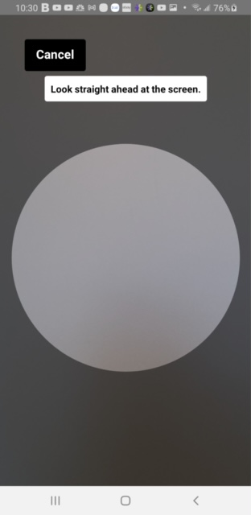
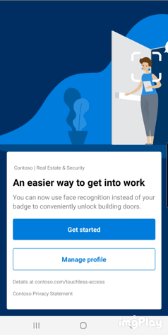

# Build an enrollment app for Android and iOS with React Native

This guide will show you how to get started with the sample Face enrollment application. The app demonstrates best practices for obtaining meaningful consent to enroll users into a face recognition service and acquire high-accuracy face data. An integrated system could use an enrollment app like this to provide touchless access control, identity verification, attendance tracking, personalization kiosk, or identity verification, based on their face data.

When launched, the application shows users a detailed consent screen. If the user gives consent, the app prompts for a username and password and then captures a high-quality face image using the device's camera.

The sample enrollment app is written using JavaScript and the React Native framework. It can currently be deployed on Android and iOS devices; more deployment options are coming in the future.




## Getting Started

### Prerequisites

* An Azure subscription – [Create one for free](https://azure.microsoft.com/free/cognitive-services/).  
* Once you have your Azure subscription, [create a Face resource](https://portal.azure.com/#create/Microsoft.CognitiveServicesFace) in the Azure portal to get your key and endpoint. After it deploys, select **Go to resource**.  
  * You'll need the key and endpoint from the resource you created to connect your application to Face API.  
  * For local development and testing only, the API key and endpoint are environment variables. For final deployment, store the API key in a secure location and never in the code or environment variables.

### Important Security Considerations
* For local development and initial limited testing, it is acceptable (although not best practice) to use environment variables to hold the API key and endpoint. For pilot and final deployments, the API key should be stored securely - which likely involves using an intermediate service to validate a user token generated during login. 
* Never store the API key or endpoint in code or commit them to a version control system (e.g. Git). If that happens by mistake, you should immediately generate a new API key/endpoint and revoke the previous ones.
* As a best practice, consider having separate API keys for development and production.

<details>
<summary>Android Quickstart</summary>

### Installation 

1. Clone the git repository for the [sample enrollment app](https://github.com/azure-samples/cognitive-services-FaceAPIEnrollmentSample).
1. To set up your development environment, follow the <a href="https://reactnative.dev/docs/environment-setup"  title="React Native documentation"  target="_blank">React Native documentation <span class="docon docon-navigate-external x-hidden-focus"></span></a>. Select **React Native CLI Quickstart**. Select your development OS and **Android** as the target OS. Complete the sections **Installing dependencies** and **Android development environment**.
1. Download your preferred text editor such as [Visual Studio Code](https://code.visualstudio.com/).
1. Retrieve your FaceAPI endpoint and key in the Azure portal under the **Overview** tab of your resource. Don't check in your Face API key to your remote repository.
1. Run the app using either the Android Virtual Device emulator from Android Studio, or your own Android device. To test your app on a physical device, follow the relevant <a href="https://reactnative.dev/docs/running-on-device"  title="React Native documentation"  target="_blank">React Native documentation <span class="docon docon-navigate-external x-hidden-focus"></span></a>.

### Quickstart

1. ```git clone https://github.com/Azure-Samples/cognitive-services-FaceAPIEnrollmentSample.git```
1. ```cd cognitive-services-FaceAPIEnrollmentSample```
1. ```cd referenceEnrollApp```
1. ```npm install```
1. Either set up an Android Vitrual Device emulator on Android Studio, or plug in your Android device via USB. To check your device is recognized run: ```adb devices```
1. Fill out all relevant values, such as your person group name, in the ```development.json``` file.
1. Set the FaceAPI key and endpoint as environment values. This is for local development purposes only. You can set environment variables when starting Metro bundler:  

    Windows example:  

    ```set "FACEAPI_ENDPOINT=<FaceAPI endpoint>" && set "FACEAPI_KEY=<FaceAPI key>" && npm start```

    macOS example:  

    ```export FACEAPI_ENDPOINT=<FaceAPI endpoint> && export FACEAPI_KEY= <FaceAPI key> &&  npm start``` 

1. Run ```npx react-native run-android```. This will build and launch the app onto the emulator or device. 

</details>


<details>
<summary> iOS Quickstart </summary>

### Installation 

1. Clone the git repository for the [sample enrollment app](https://github.com/azure-samples/cognitive-services-FaceAPIEnrollmentSample).
1. To set up your development environment, follow the <a href="https://reactnative.dev/docs/environment-setup"  title="React Native documentation"  target="_blank">React Native documentation <span class="docon docon-navigate-external x-hidden-focus"></span></a>. Select **React Native CLI Quickstart**. Select **macOS** as your development OS and **iOS** as the target OS. Complete the section **Installing dependencies**.
1. Download your preferred text editor such as [Visual Studio Code](https://code.visualstudio.com/). You will also need to download Xcode. 
1. Retrieve your FaceAPI endpoint and key in the Azure portal under the **Overview** tab of your resource. Don't check in your Face API key to your remote repository.
1. Run the app using either a simulated device from Xcode, or your own iOS device. To test your app on a physical device, follow the relevant <a href="https://reactnative.dev/docs/running-on-device"  title="React Native documentation"  target="_blank">React Native documentation <span class="docon docon-navigate-external x-hidden-focus"></span></a>.

### Quickstart

1. ```git clone https://github.com/Azure-Samples/cognitive-services-FaceAPIEnrollmentSample.git```
1. ```cd cognitive-services-FaceAPIEnrollmentSample```
1. ```cd referenceEnrollApp```
1. ```npm install```
1. ```cd ios```
1. ```pod install```
1. Fill out all relevant values, such as your person group name, in the ```development.json``` file.
1. Set the FaceAPI key and endpoint as environment values. This is for local development purposes only. You can set environment variables when starting Metro bundler:  
    ```export FACEAPI_ENDPOINT=<FaceAPI endpoint> && export FACEAPI_KEY= <FaceAPI key> &&  npm start``` 
1. Either build and run the app through Xcode on a simulator, or plug in your iOS device via USB and run ```npm run ios --device <device name>```. This will build and launch the app onto the simulated or physical device. 
</details>


## Create an enrollment experience  

Now that you have set up the sample enrollment app, you can tailor it to your own enrollment experience needs.

For example, you may want to add situation-specific information on your consent page:

 

The service provides image quality checks to help you make the choice of whether the image is of sufficient quality to enroll the customer or attempt face recognition. This app demonstrates how to access frames from the device's camera, select the highest-quality frames, and enroll the detected face into the Face API service. 

Many face recognition issues are caused by low-quality reference images. Some factors that can degrade model performance are:
* Face size (faces that are distant from the camera)
* Face orientation (faces turned or tilted away from camera)
* Poor lighting conditions (either low light or backlighting) where the image may be poorly exposed or have too much noise
* Occlusion (partially hidden or obstructed faces) including accessories like hats or thick-rimmed glasses)
* Blur (such as by rapid face movement when the photograph was taken). 

 

Notice the app also offers functionality for deleting the user's enrollment and the option to re-enroll.

 

To extend the app's functionality to cover the full enrollment experience, read the [overview](https://docs.microsoft.com/en-us/azure/cognitive-services/face/enrollment-overview) for additional features to implement and best practices.

## Deploy the enrollment app

<details>
<summary>Android</summary>

First, make sure that your app is ready for production deployment: remove any keys or secrets from the app code and make sure you have followed the [security best practices](https://docs.microsoft.com/azure/cognitive-services/cognitive-services-security?tabs=command-line%2Ccsharp).

When you're ready to release your app for production, you'll generate a release-ready APK file, which is the package file format for Android apps. This APK file must be signed with a private key. With this release build, you can begin distributing the app to your devices directly. 

Follow the <a href="https://developer.android.com/studio/publish/preparing#publishing-build"  title="Prepare for release"  target="_blank">Prepare for release <span class="docon docon-navigate-external x-hidden-focus"></span></a> documentation to learn how to generate a private key, sign your application, and generate a release APK.  

Once you've created a signed APK, see the <a href="https://developer.android.com/studio/publish"  title="Publish your app"  target="_blank">Publish your app <span class="docon docon-navigate-external x-hidden-focus"></span></a> documentation to learn more about how to release your app.
</details>

<details>
<summary>iOS</summary>

First, make sure that your app is ready for production deployment: remove any keys or secrets from the app code and make sure you have followed the [security best practices](https://docs.microsoft.com/azure/cognitive-services/cognitive-services-security?tabs=command-line%2Ccsharp). To prepare for distribution, you will need to create an app icon, a launch screen, and configure deployment info settings. Follow the [documentation from Xcode](https://developer.apple.com/documentation/Xcode/preparing_your_app_for_distribution) to prepare your app for distribution. 

When you're ready to release your app for production, you'll build an archive of your app. Follow the [Xcode documentation](https://developer.apple.com/documentation/Xcode/distributing_your_app_for_beta_testing_and_releases) on how to create an archive build and options for distributing your app.  
</details>

## Resources

In this guide, you learned how to set up your development environment and get started with the sample enrollment app. If you're new to React Native, you can read their [getting started docs](https://reactnative.dev/docs/getting-started) to learn more background information. It also may be helpful to familiarize yourself with [Face API](Overview.md). Read the other sections on enrollment app documentation before you begin development.

